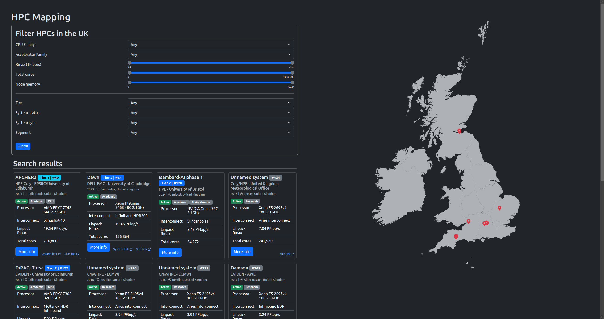
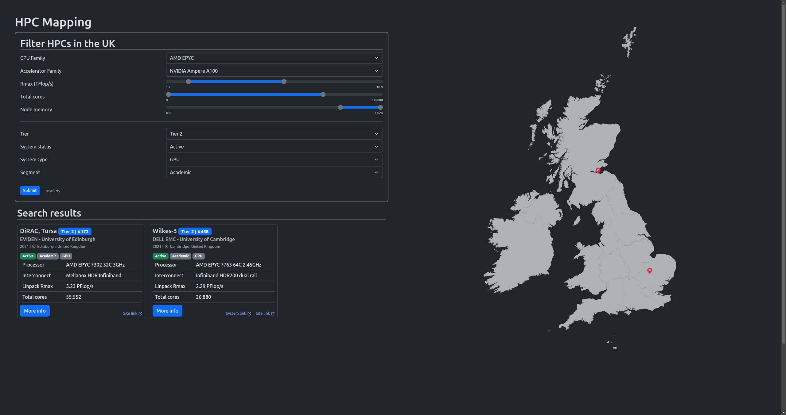
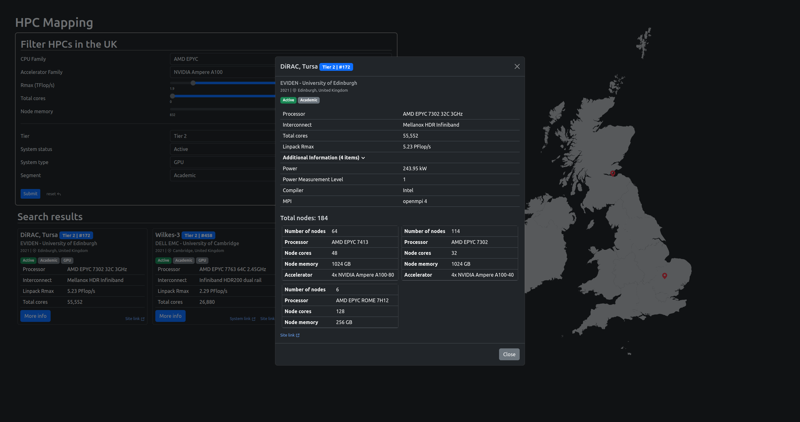

# UK HPC Mapping
This project is the result of my [Nuffield Research Placement](https://www.nuffieldresearchplacements.org/) at [EPCC](https://www.epcc.ed.ac.uk/) in Edinburgh. My placement involved creating a resource to help researchers find more information on HPCs (High Performance Computers/Computing) in the UK.

This project is not a python package/library for external use, neither is it a maintained or complete repository for all HPCs in the UK. It is not meant to be well structured/written as this project is a proof of concept made in a short amount of time and limited resources.

## Usage
The front end is a single page static site which uses AJAX to fetch and filter HPCs on the website.

The back-end is hosted by `web/server.py`which uses [Flask](https://flask.palletsprojects.com/en/3.0.x/) to serve static files and API endpoints.

The `Makefile` is used to create the database and scrape information from [Top500](https://www.top500.org/) and add other information gathered. There are also a series of 'constructing' SQL files in `sql/constructing`. They are run in a certain to insert additional information not gathered from Top500.

The script `scraping/top500.py` uses `requests` and `pyquery` to scrape Top500 and navigate through different pages. Instead of loading the [Sublist generator](https://www.top500.org/statistics/sublist/) web page with `requests`, the page is loaded from a file due to me not wanting to deal with keep-alive connections (could be a future to-do)·

The reference for the scraping script is as follows:
```
python top500py [path to scraping folder]
```
The path to scraping folder is optional and is there to allow it to be called from any working directory and still be able to find database file and downloaded sublist generator page. A path to the database and to the downloaded page would be a better design.

This project uses SQLite3 on the back-end as it is a small project. The `sql` folder contains many queries for 'constructing' the database and also for the developer to debug and check the database. The SQL files are run with `db.py`.
```
python db.py <path to sql file> [output format]
```
The default output format is as a tuple (`(value1, value2, ...)`). In the presence of a 2nd argument, the output will be formatted as a dictionary.

## Sources and Resources
#### Data
- [Top500](https://www.top500.org/) - HPC data
- [Top500 Sublist generator](https://www.top500.org/statistics/sublist/) - HPCs in the UK
- [Google maps](https://maps.google.com/) - HPC site coordinates
- Hardware details links in `sql/construcuting/system_details.sql`
#### Frontend
- [Bootstrap](https://getbootstrap.com/) - styling
- [SVG Inject](https://github.com/iconfu/svg-inject)
- [Octicons](https://getbootstrap.com/) - icons
- [MapSVG](https://mapsvg.com/maps/united-kingdom) - map
